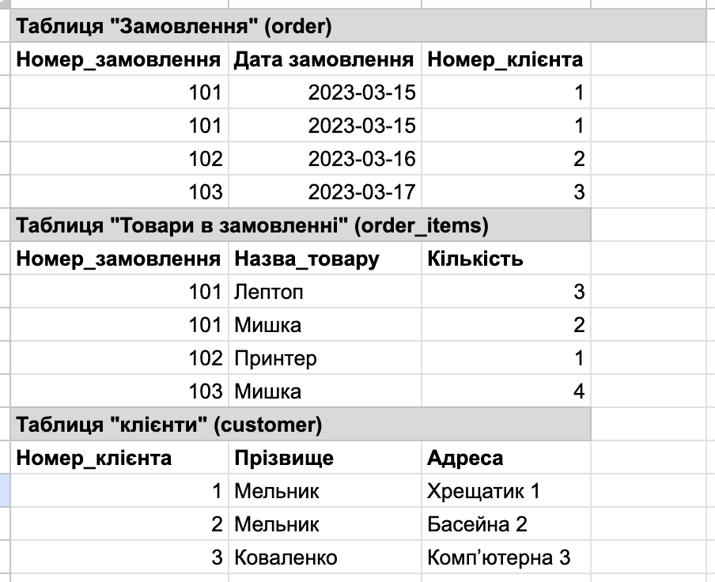

# goit-rdb-hw-02

Author: M.Podopryhora

Google Sheets:
[click here](https://docs.google.com/spreadsheets/d/1x8epS1bDtD3y2tzFaVziLFG2HnIrDasR9G9zBiisD6o/edit?usp=sharing)

## Initial table

## 1. 1NF

## 2. 2NF

## 3. 3NF

## 4. ER-diagram

## 5. DB schema

